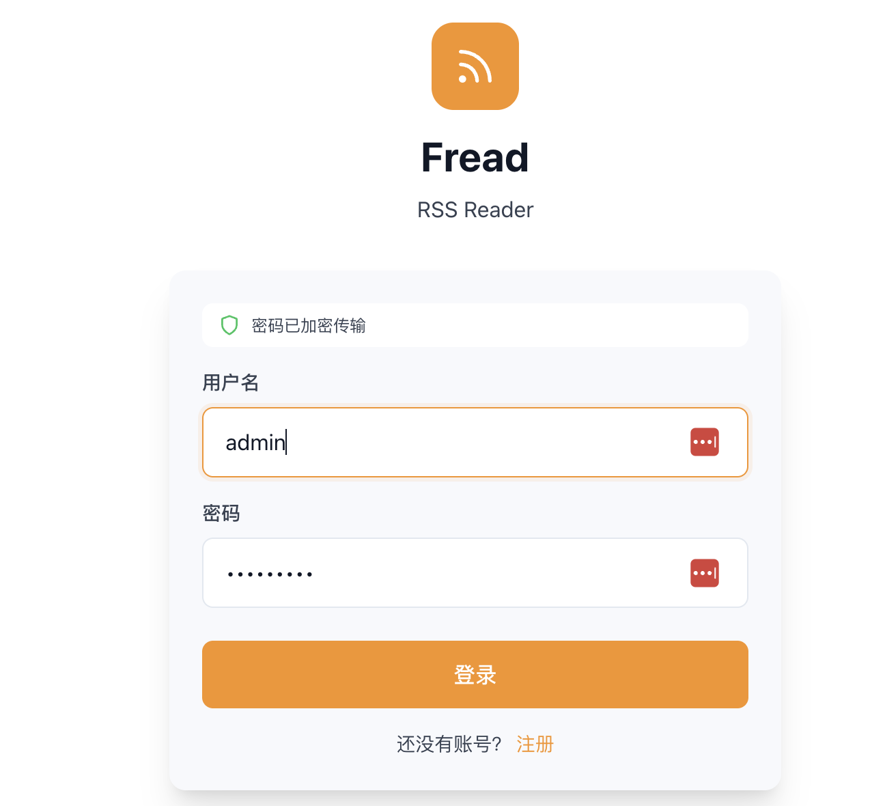
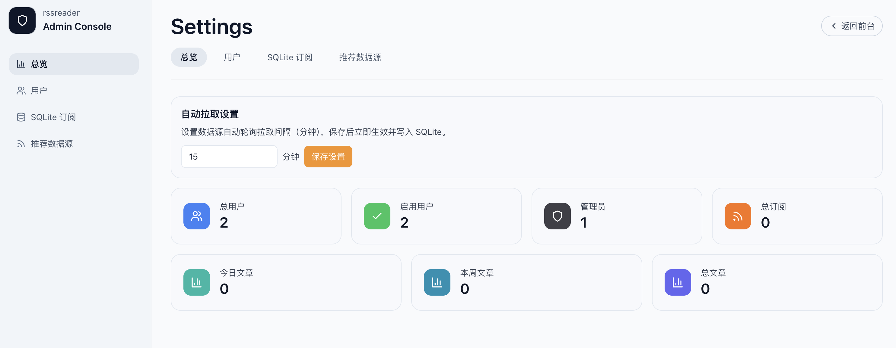
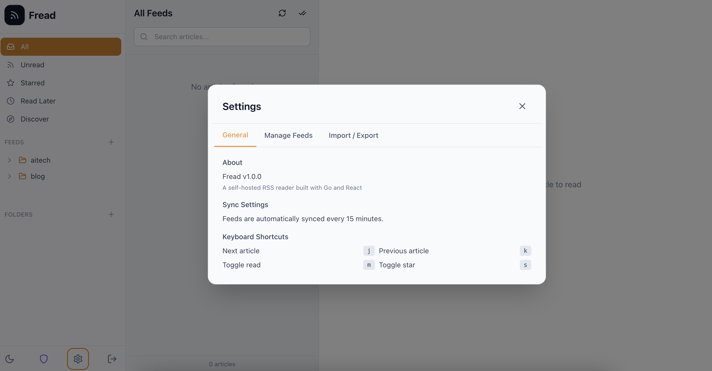

# Fread - Self-Hosted RSS Reader

A modern, self-hosted RSS reader built with Go + React + SQLite. Take control of your news feed with a clean, fast, and distraction-free reading experience.


*Secure JWT authentication with a clean, modern interface*

---

## Features

### Core Features

- 📰 **RSS/Atom Subscription** - Subscribe and manage RSS/Atom feeds with batch import support
- 📚 **Smart Reading** - Clean reading experience with full-text search
- 🔖 **Read Later** - Save articles for later reading
- 📁 **Folder Management** - Organize feeds with folders
- ⭐ **Bookmarking** - Star important articles
- 🔧 **Background Sync** - Auto-update feeds with configurable intervals (default 15min)
- 📤 **OPML Import/Export** - Standard OPML format support

### User Experience

- 🎨 **Modern UI** - Beautiful warm-toned dark/light themes
- 📱 **Mobile Responsive** - Perfect for phones and tablets
- ⌨️ **Keyboard Shortcuts** - Efficient keyboard navigation
- 🚀 **Onboarding** - Guided setup for first-time users
- 🔍 **Feed Discovery** - Built-in recommended feeds


*Admin dashboard with system statistics and user management*

### Admin Features

- 👥 **Multi-User Support** - Multiple user accounts
- 🛡️ **Admin Panel** - User management, system stats, account control
- 🔐 **JWT Authentication** - Secure token-based auth
- 🔒 **Self-Hosted** - Docker deployment, full data control


*User settings with theme preferences and account management*

---

## Quick Start

### Docker Deploy (Recommended)

```bash
# Clone repository
git clone <repo-url>
cd rssreader

# Start services
docker-compose up -d

# Access http://localhost:8080
# Default account: admin / admin
```

### One-Click Deploy Script

```bash
# Build and deploy to remote server
./deploy.sh
```

### Local Development

#### Backend

```bash
# Install Go dependencies
go mod download

# Run backend
go run ./cmd/server
```

#### Frontend

```bash
cd ui

# Install dependencies
pnpm install

# Development mode
pnpm dev

# Build production
pnpm build
```

---

## Environment Variables

| Variable | Default | Description |
|----------|---------|-------------|
| `DATABASE_PATH` | `./data/rssreader.db` | SQLite database path |
| `JWT_SECRET` | `change-me-in-production` | JWT signing key (change in production) |
| `SERVER_PORT` | `8080` | Service port |
| `FETCH_INTERVAL` | `15` | Fetch interval (minutes) |
| `FETCH_CONCURRENCY` | `5` | Concurrent fetch limit |

---

## API Endpoints

### Authentication

- `POST /api/v1/login` - User login
- `POST /api/v1/register` - User registration
- `GET /api/v1/me` - Current user info

### Feeds

- `GET /api/v1/feeds` - List all feeds
- `POST /api/v1/feeds` - Add feed
- `POST /api/v1/feeds/batch` - Batch add feeds
- `GET /api/v1/feeds/:id` - Feed details
- `DELETE /api/v1/feeds/:id` - Delete feed
- `POST /api/v1/feeds/:id/fetch` - Manual refresh

### Articles

- `GET /api/v1/articles` - List articles (filter by: feed_id, folder_id, is_read, is_starred, is_read_later, q)
- `GET /api/v1/articles/:id` - Article details
- `PATCH /api/v1/articles/:id` - Update status (read/star/read_later)
- `POST /api/v1/articles/mark-all-read` - Mark all as read

### Folders

- `GET /api/v1/folders` - List folders
- `POST /api/v1/folders` - Create folder
- `DELETE /api/v1/folders/:id` - Delete folder

### Stats

- `GET /api/v1/stats` - User statistics

### OPML

- `POST /api/v1/opml/import` - Import OPML
- `GET /api/v1/opml/export` - Export OPML

### Admin (requires admin permission)

- `GET /api/v1/admin/stats` - System stats
- `GET /api/v1/admin/users` - User list
- `POST /api/v1/admin/users` - Create user
- `GET /api/v1/admin/users/:id` - User details
- `PATCH /api/v1/admin/users/:id` - Update user
- `DELETE /api/v1/admin/users/:id` - Delete user
- `GET /api/v1/admin/users/:id/stats` - User stats

---

## Tech Stack

### Backend
- **Go 1.21+** - High-performance backend
- **Chi** - Lightweight HTTP router
- **SQLite** - Embedded database, zero config
- **gofeed** - RSS/Atom parser
- **JWT** - Secure authentication
- **bcrypt** - Password hashing

### Frontend
- **React 18** + **TypeScript** - Modern frontend
- **Vite** - Fast build tool
- **TailwindCSS** - Atomic CSS framework
- **React Query (TanStack Query)** - Server state management
- **Zustand** - Lightweight state management
- **Lucide React** - Beautiful icons
- **date-fns** - Date handling
- **DOMPurify** - XSS protection

---

## Project Structure

```
rssreader/
├── cmd/
│   └── server/          # Main entry point
├── internal/
│   ├── api/             # HTTP handlers and routes
│   ├── auth/            # JWT authentication
│   ├── config/          # Configuration
│   ├── fetcher/         # RSS fetcher (background tasks)
│   ├── models/          # Data models
│   └── store/           # Database layer
├── migrations/          # Database migrations
├── data/                # Data directory (DB, recommended feeds)
├── ui/                  # React frontend
│   ├── src/
│   │   ├── api/         # API client and React Query hooks
│   │   ├── components/  # Reusable components
│   │   ├── layouts/     # Layout components
│   │   ├── pages/       # Page components
│   │   ├── stores/      # Zustand state management
│   │   ├── hooks/       # Custom hooks
│   │   └── types/       # TypeScript types
│   └── ...
├── deploy/              # Deployment artifacts
├── Dockerfile           # Docker image build
├── docker-compose.yml   # Docker Compose config
├── Makefile             # Build scripts
├── deploy.sh            # One-click deploy script
└── README.md
```

---

## Deployment

### Server Requirements

- Docker and Docker Compose
- Port 8080 open (or custom port)

### Production Configuration

1. Change `JWT_SECRET` to a secure random string
2. Configure reverse proxy (Nginx/Caddy) with HTTPS
3. Regularly backup `data/rssreader.db`

### Change Admin Password

Via admin panel `/admin` or API:
```bash
curl -X PATCH http://localhost:8080/api/v1/admin/users/1 \
  -H "Authorization: Bearer <token>" \
  -H "Content-Type: application/json" \
  -d '{"password": "newpassword"}'
```

---

